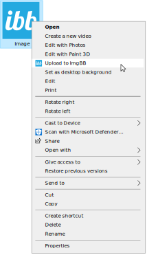
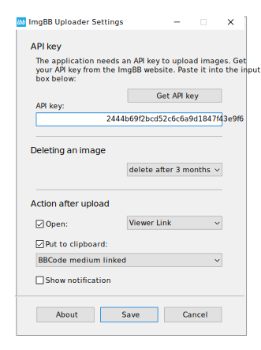

<a href="site/readme_ru.md">RU</a>

#  ImgBB Uploader

Utility for uploading images to [ImgBB](https://ibb.com) photohosting.

Adds Upload to ImgBB to the context menu of Windows Explorer for supported image formats:

A little bit of your preference in the settings:

Based on [ImgBB API](https://api.imgbb.com/). 
Uses [cURL](https://curl.se/). 
Created with [AutoIt](https://www.autoitscript.com/site/). 
OS: Windows 10, Windows 11
Language: English, Russian
Author: NyBumBum

>*Tip: In Windows 11 it's more convenient to use Windows Explorer extended context menu (SHIFT + right mouse button).*

