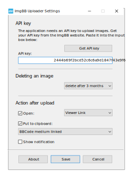

<a href="https://github.com/nbb1967/imgbb-uploader/blob/main/site/Readme_ru.md">RU</a>

-----------------
Utility for uploading images to [ImgBB](https://imgbb.com/) photohosting.
 
 
 
Adds Upload to ImgBB to the context menu of Windows Explorer for supported image formats:
 
 

 
 
 
A little bit of your preference in the settings:
 
 

 
 
 
Based on [ImgBB API](https://api.imgbb.com/).     
Uses [cURL](https://curl.se/).     
Created with [AutoIt](https://www.autoitscript.com/site/).     
OS: Windows 10/11    
Language: English, Russian     
Author: NyBumBum    
 
 
 
>*Tip: In Windows 11 it's more convenient to use Windows Explorer extended context menu (SHIFT + right mouse button).*
