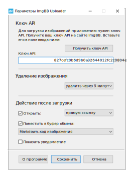

<a href="https://github.com/nbb1967/imgbb-uploader">EN</a>
 

-----------------
Утилита для загрузки изображений на фотохостинг [ImgBB](https://imgbb.com/).
 
 
 
Добавляет в контекстное меню Проводника Windows для поддерживаемых форматов изображений пункт Загрузить на ImgBB:
 
 

 
 
 
Немного ваших предпочтений в настройках:

 
 

Основано на [ImgBB API](https://api.imgbb.com/).    
Использует [cURL](https://curl.se/).    
Создано с [AutoIt](https://www.autoitscript.com/site/).    
ОС: Windows 10/11    
Язык: русский, английский    
Автор: NyBumBum     
 
 
 
>*Совет: В Windows 11 удобнее использовать расширенное контекстное меню Проводника Windows (SHIFT + правая кнопка мыши).*
